# Authorization Engine

## Flexible RBAC + Scope + ReBAC + Policy Authorization for .NET / EF Core

## 1. الهدف

تصميم محرك Authorization عام ومرن يمكن استخدامه في الأنظمة الإدارية وERP والمنصات متعددة الشركات والمشاريع، بحيث لا يعتمد على أدوار ثابتة مثل:

* CompanyManager
* BranchManager
* Employee
* ProjectManager

بل يسمح بإنشاء أدوار مخصصة وربطها بمجموعة من الصلاحيات، ثم تحديد نطاق تطبيق هذه الصلاحيات باستخدام Scopes وRelationships وPolicies.

المحرك يجب أن يدعم:

* Role-Based Access Control — RBAC
* Scope-Based Authorization
* Resource-Based Authorization
* Relationship-Based Access Control — ReBAC
* Policy-Based Authorization
* Feature Authorization
* Data Authorization
* Field-Level Authorization
* Explicit Allow / Deny
* Delegation
* Temporary Permissions
* Multi-Tenancy
* Authorization Audit
* Hierarchical Resources
* Arbitrary organizational structures

---

# 2. المبادئ الأساسية

## 2.1 Role لا يحدد مكان الصلاحية

الـ Role يحدد:

> ماذا يستطيع المستخدم أن يفعل؟

مثال:

```text
Project Manager

project.read
project.update
task.read
task.create
task.update
```

لكن الـ Role لا يحدد المشروع أو القسم.

---

## 2.2 Scope يحدد أين تطبق الصلاحية

مثال:

```text
Scope Type = department
Scope Id   = 50
```

أو:

```text
Scope Type = project
Scope Id   = 500
```

وبالتالي:

```text
Role + Scope = صلاحيات ضمن نطاق محدد
```

---

# 3. النموذج العام

```text
Subject
   │
   │ Assignment
   ▼
Role
   │
   ├── Permissions
   │
   └── Scope
          │
          ▼
       Resources
          │
          ├── Relationships
          │
          └── Policies
```

قرار Authorization النهائي:

```text
Authorization Decision =
    Subject
    + Permission
    + Resource
    + Scope
    + Relationship
    + Policy
    + Context
```

---

# 4. Subject

الـ Subject هو الكيان الذي يطلب الصلاحية.

يمكن أن يكون:

```text
User
Team
Group
ServiceAccount
SystemAgent
AI Agent
```

ولا يجب أن يكون المحرك مرتبطًا مباشرة بجدول Users في الـ Domain.

## Subjects

```text
Subjects
--------
Id
TenantId
SubjectType
ExternalId
DisplayName
IsActive
CreatedAt
UpdatedAt
```

مثال:

```text
SubjectType = User
ExternalId  = User GUID
```

---

# 5. Permissions

الـ Permission هي الوحدة الأساسية التي تحدد ما يمكن فعله.

أمثلة:

```text
project.read
project.create
project.update
project.delete

task.read
task.create
task.update
task.delete

invoice.read
invoice.create
invoice.update
invoice.approve
```

## Permissions Table

```text
Permissions
-----------
Id
TenantId
Key
Name
Description
ResourceType
Action
PermissionType
IsSystem
IsActive
CreatedAt
UpdatedAt
```

### PermissionType

```text
Feature
Resource
Field
System
```

---

# 6. Feature Authorization

الـ Feature Authorization تحدد هل يستطيع المستخدم استخدام وظيفة أو شاشة أو ميزة معينة.

أمثلة:

```text
feature.dashboard.view
feature.reports.view
feature.invoices.view
feature.invoices.create
feature.invoices.approve
feature.authorization.manage
feature.ai.voice_commands.use
```

## Features

```text
Features
--------
Id
TenantId
Key
Name
Description
ParentFeatureId
IsActive
CreatedAt
UpdatedAt
```

يمكن بناء شجرة Features:

```text
Reports
├── Sales Reports
├── Supplier Reports
└── Financial Reports

Invoices
├── View
├── Create
├── Edit
└── Approve
```

---

# 7. Resource Authorization

Resource Authorization تحدد ماذا يستطيع المستخدم أن يفعل على Resource معين.

مثال:

```text
project.update
```

لا تعني أن المستخدم يستطيع تعديل جميع المشاريع.

بل تعني أن المستخدم لديه القدرة على تعديل Project، وبعدها يتم استخدام Scope وRelationships لمعرفة المشاريع التي يمكنه تعديلها.

---

# 8. Roles

Role هو مجموعة من Permissions.

## Roles

```text
Roles
-----
Id
TenantId
Name
Description
IsSystem
IsActive
CreatedAt
UpdatedAt
```

مثال:

```text
Role:
Project Manager
```

صلاحياته:

```text
project.read
project.update
task.read
task.create
task.update
task.delete
```

---

# 9. RolePermissions

```text
RolePermissions
---------------
RoleId
PermissionId
Effect
```

## Effect

```csharp
public enum PermissionEffect
{
    Allow = 1,
    Deny = 2
}
```

وجود Deny يسمح بإنشاء استثناءات داخل Role.

---

# 10. Scopes

الـ Scope يحدد حدود تطبيق الصلاحية.

الـ Scope ليس بالضرورة Company أو Department.

يمكن أن يكون أي Resource:

```text
company:10
branch:20
department:50
project:500
document:1000
```

## Scopes

```text
AuthorizationScopes
-------------------
Id
TenantId
Name
ResourceType
ResourceId
InheritanceMode
IsActive
CreatedAt
UpdatedAt
```

مثال:

```text
Id           = Scope GUID
ResourceType = department
ResourceId   = 50
```

---

# 11. Scope Inheritance

يمكن أن ينتقل Scope من Resource إلى Resources أخرى من خلال العلاقات.

مثال:

```text
Department:50
      │
      ├── Project:500
      │       ├── Task:1
      │       └── Task:2
      │
      └── Project:700
              └── Task:3
```

إذا كان:

```text
Scope = Department:50
```

فيمكن أن يشمل:

```text
Project:500
Project:700
Task:1
Task:2
Task:3
```

حسب قواعد الـ Scope.

---

# 12. ScopeInheritanceRules

```text
ScopeInheritanceRules
---------------------
Id
ScopeId
SourceResourceType
Relation
TargetResourceType
Allowed
```

مثال:

```text
Scope = department:50

department
    contains
project

project
    contains
task
```

---

# 13. Resource Relationships

الـ Relationship تمثل العلاقات بين الـ Subjects والـ Resources أو بين Resources نفسها.

أمثلة:

```text
User:100 member_of Project:500

User:200 manager_of Department:50

Project:500 belongs_to Department:50

Task:300 belongs_to Project:500
```

## ResourceRelationships

```text
ResourceRelationships
---------------------
Id
TenantId
SubjectType
SubjectId
Relation
ResourceType
ResourceId
ExpiresAt
CreatedAt
```

لكن يمكن توسيع النموذج ليشمل Resource → Resource أيضًا.

الأفضل في النموذج العام استخدام:

```text
SourceType
SourceId
Relation
TargetType
TargetId
```

مثال:

```text
Project:500
    belongs_to
Department:50
```

---

# 14. Resource Graph

العلاقات تشكل Graph:

```text
Company:1
   │
   ├── contains → Department:50
   │                 │
   │                 └── contains → Project:500
   │                                      │
   │                                      └── contains → Task:300
   │
   └── contains → Department:70
```

وهذا يسمح للمحرك بفهم موقع Resource دون hard-code داخل Authorization Engine.

---

# 15. كيف يعرف المحرك موقع Resource؟

لا يجب أن يحتوي المحرك على:

```csharp
if (resource.Type == "project")
{
    project.DepartmentId
}
```

بل يجب استخدام:

```text
Resource Graph Provider
```

مثال:

```csharp
public interface IResourceGraphProvider
{
    Task<IReadOnlyCollection<ResourceReference>>
        GetRelatedResourcesAsync(
            ResourceReference resource,
            string relation,
            CancellationToken cancellationToken);
}
```

مثال:

```text
project:500
    belongs_to
department:50
```

فيعرف المحرك أن:

```text
project:500 ∈ department:50
```

---

# 16. ResourceReference

```csharp
public sealed record ResourceReference(
    string Type,
    Guid Id);
```

مثال:

```csharp
new ResourceReference(
    "project",
    projectId);
```

---

# 17. Role Assignments

Role لا يصبح فعالًا للمستخدم إلا من خلال Assignment.

## RoleAssignments

```text
RoleAssignments
---------------
Id
TenantId
SubjectId
RoleId
ScopeId
Priority
ValidFrom
ValidUntil
IsActive
CreatedAt
CreatedBy
```

---

# 18. مثال إضافة موظف للشركة

الموظف:

```text
Ahmed
```

عضو في الشركة:

```text
CompanyMembership

User   = Ahmed
Company = ACME
Role   = Member
```

ثم نريد إعطاءه دورًا على Project:

```text
Role = Project Manager
Scope = Project:500
```

لا ننشئ Role جديدًا باسم:

```text
Ahmed Project 500 Manager
```

بل نستخدم Role موجودًا:

```text
Project Manager
```

ثم:

```text
RoleAssignment

Subject = Ahmed
Role    = Project Manager
Scope   = Project:500
```

---

# 19. Assignment Model

النموذج الأساسي:

```text
Subject
   +
Role
   +
Scope
   +
Validity
   +
Priority
   =
RoleAssignment
```

مثال:

```text
Ahmed
  │
  ├── Project Manager
  │      └── Project:500
  │
  └── Project Member
         └── Project:700
```

---

# 20. Permission Assignments

في بعض الحالات نحتاج إعطاء Permission مباشرة بدون Role.

## PermissionAssignments

```text
PermissionAssignments
---------------------
Id
TenantId
SubjectId
PermissionId
ScopeId
Effect
ValidFrom
ValidUntil
CreatedAt
CreatedBy
```

مثال:

```text
Ahmed
    permission = invoice.approve
    scope      = branch:10
```

---

# 21. Policies

Policy تضيف شروطًا ديناميكية إلى القرار.

مثال:

```text
invoice.approve
AND
invoice.status != posted
AND
invoice.amount <= approval_limit
```

## Policies

```text
Policies
--------
Id
TenantId
Name
Description
Effect
Priority
DefinitionJson
Version
IsActive
CreatedAt
UpdatedAt
```

---

# 22. Policy JSON

يجب عدم السماح للمستخدمين بتخزين C# أو SQL وتنفيذه مباشرة.

يفضل استخدام DSL آمن.

مثال:

```json
{
  "all": [
    {
      "field": "resource.status",
      "operator": "neq",
      "value": "posted"
    },
    {
      "field": "resource.amount",
      "operator": "lte",
      "valueFrom": "subject.approvalLimit"
    }
  ]
}
```

---

# 23. Permission Overrides

للحالات الاستثنائية:

```text
PermissionOverrides
-------------------
Id
TenantId
SubjectId
PermissionId
ResourceType
ResourceId
Effect
Priority
Reason
ValidFrom
ValidUntil
CreatedAt
CreatedBy
```

مثال:

```text
Role:
    project.update

Override:
    project:500
    Effect = Deny
```

فتصبح النتيجة:

```text
المستخدم يستطيع تعديل المشاريع عمومًا
لكن لا يستطيع تعديل Project 500
```

---

# 24. Delegation

دعم تفويض الصلاحيات لفترة معينة.

## Delegations

```text
Delegations
-----------
Id
TenantId
DelegatorSubjectId
DelegateeSubjectId
ScopeId
ValidFrom
ValidUntil
IsActive
CreatedAt
```

## DelegationPermissions

```text
DelegationPermissions
---------------------
DelegationId
PermissionId
Effect
```

---

# 25. Field-Level Authorization

يمكن التحكم في الحقول الحساسة.

مثال:

```text
invoice.cost_price.read
invoice.cost_price.update

supplier.balance.read
employee.salary.read
```

مثال:

```text
User يستطيع:
invoice.read
```

لكن:

```text
invoice.cost_price.read
```

غير مسموحة.

وبالتالي يمكن عرض:

```text
Invoice:
    Product
    Quantity
    SellingPrice
```

وإخفاء:

```text
CostPrice
```

---

# 26. Data Authorization

Data Authorization يجب أن تعمل على مستوى الاستعلام قدر الإمكان.

بدل:

```text
SELECT * FROM Projects
```

ثم حذف النتائج غير المسموحة في الذاكرة.

يجب بناء الاستعلام بحيث يعيد فقط البيانات المسموحة.

مثال مفاهيمي:

```csharp
var query = dbContext.Projects.AsQueryable();

query = authorizationFilter.Apply(
    query,
    currentUser,
    "project.read");
```

والنتيجة:

```sql
SELECT *
FROM Projects
WHERE DepartmentId IN (...)
```

أو حسب العلاقة المطلوبة.

---

# 27. Feature Authorization

يمكن استخدام:

```csharp
await featureAuthorizationService.CanUseAsync(
    userId,
    "reports");
```

أما Resource Authorization:

```csharp
await authorizationService.CanAsync(
    userId,
    "project.update",
    new ResourceReference("project", projectId));
```

---

# 28. الفرق بين Feature وData Authorization

```text
Feature Authorization
---------------------
هل يستطيع المستخدم استخدام الميزة؟

Data Authorization
------------------
ما البيانات التي يستطيع الوصول إليها؟

Resource Authorization
----------------------
ما الذي يستطيع فعله بالسجل؟

Field Authorization
-------------------
ما الحقول التي يستطيع رؤيتها أو تعديلها؟
```

مثال:

```text
feature.reports.view
```

يسمح بفتح التقارير.

لكن:

```text
report.read
```

يحدد البيانات التي يمكن قراءتها.

---

# 29. Authorization Context

```csharp
public sealed record AuthorizationContext
{
    public Guid TenantId { get; init; }

    public Guid SubjectId { get; init; }

    public string SubjectType { get; init; } = "User";

    public string Action { get; init; } = null!;

    public ResourceReference? Resource { get; init; }

    public string? IpAddress { get; init; }

    public string? DeviceId { get; init; }

    public bool IsMfaAuthenticated { get; init; }

    public DateTime Timestamp { get; init; }
}
```

---

# 30. Authorization Result

```csharp
public sealed record AuthorizationResult(
    bool Allowed,
    string ReasonCode,
    Guid? PolicyId = null)
{
    public static AuthorizationResult Allow(
        string reason = "ALLOWED")
        => new(true, reason);

    public static AuthorizationResult Deny(
        string reason)
        => new(false, reason);
}
```

---

# 31. Authorization Service

```csharp
public interface IAuthorizationService
{
    Task<AuthorizationResult> AuthorizeAsync(
        AuthorizationContext context,
        CancellationToken cancellationToken = default);

    Task<bool> CanAsync(
        Guid subjectId,
        string action,
        ResourceReference resource,
        CancellationToken cancellationToken = default);
}
```

---

# 32. Architecture

يجب عدم وضع جميع المنطق في Method واحدة.

```text
IAuthorizationService
        │
        ▼
AuthorizationEngine
        │
        ├── TenantResolver
        │
        ├── PermissionResolver
        │
        ├── AssignmentResolver
        │
        ├── ScopeResolver
        │
        ├── RelationshipResolver
        │
        ├── PolicyEvaluator
        │
        ├── OverrideResolver
        │
        ├── FeatureAuthorization
        │
        └── DecisionEngine
```

---

# 33. PermissionResolver

مسؤوليته:

```text
Subject
    ↓
Roles
    ↓
RolePermissions
    ↓
Direct Permissions
```

والنتيجة:

```text
Candidate Permissions
```

---

# 34. AssignmentResolver

يحدد جميع الـ Assignments الفعالة:

```text
Subject
   ↓
RoleAssignments
   ↓
PermissionAssignments
```

مع مراعاة:

```text
IsActive
ValidFrom
ValidUntil
TenantId
```

---

# 35. ScopeResolver

يحدد:

```text
هل Resource المطلوب يقع داخل Scope الخاص بالـ Assignment؟
```

مثال:

```text
Scope = department:50

Requested Resource = project:500
```

يستعلم عن العلاقات:

```text
project:500
    belongs_to
department:50
```

ثم:

```text
Scope Match = true
```

---

# 36. RelationshipResolver

يتعامل مع ReBAC.

مثال:

```text
User:10
    member_of
Project:500
```

أو:

```text
User:20
    manager_of
Department:50
```

أو:

```text
Project:500
    belongs_to
Department:50
```

---

# 37. PolicyEvaluator

بعد التأكد من Permission وScope وRelationships يتم تقييم Policies.

مثال:

```text
User لديه invoice.approve

لكن:

invoice.status = posted
```

Policy:

```text
status != posted
```

النتيجة:

```text
DENY
```

---

# 38. DecisionEngine

يأخذ نتائج جميع الطبقات ويصدر القرار النهائي.

قاعدة عامة:

```text
Default Deny
```

ويجب أن يكون Explicit Deny قادرًا على منع Allow حسب Priority والقواعد المحددة.

---

# 39. Authorize Algorithm

```csharp
public async Task<AuthorizationResult> AuthorizeAsync(
    AuthorizationContext context,
    CancellationToken cancellationToken = default)
{
    ValidateContext(context);

    // 1. Tenant Isolation
    if (!await tenantResolver.IsAllowedAsync(
        context,
        cancellationToken))
    {
        return AuthorizationResult.Deny(
            "TENANT_ACCESS_DENIED");
    }

    // 2. Resolve Permissions
    var candidates =
        await permissionResolver.ResolveAsync(
            context,
            cancellationToken);

    if (candidates.Count == 0)
    {
        return AuthorizationResult.Deny(
            "PERMISSION_NOT_FOUND");
    }

    // 3. Resolve Assignments
    var assignments =
        await assignmentResolver.ResolveAsync(
            context,
            candidates,
            cancellationToken);

    if (assignments.Count == 0)
    {
        return AuthorizationResult.Deny(
            "NO_VALID_ASSIGNMENT");
    }

    // 4. Resolve Scope
    var scoped =
        await scopeResolver.ResolveAsync(
            context,
            assignments,
            cancellationToken);

    if (scoped.Count == 0)
    {
        return AuthorizationResult.Deny(
            "SCOPE_DENIED");
    }

    // 5. Resolve Relationships
    var related =
        await relationshipResolver.ResolveAsync(
            context,
            scoped,
            cancellationToken);

    // 6. Evaluate Policies
    var policyResult =
        await policyEvaluator.EvaluateAsync(
            context,
            related,
            cancellationToken);

    if (!policyResult.Allowed)
    {
        return AuthorizationResult.Deny(
            policyResult.ReasonCode);
    }

    // 7. Explicit Overrides
    var overrides =
        await overrideResolver.ResolveAsync(
            context,
            cancellationToken);

    if (overrides.HasExplicitDeny)
    {
        return AuthorizationResult.Deny(
            "EXPLICIT_DENY");
    }

    if (overrides.HasExplicitAllow)
    {
        return AuthorizationResult.Allow(
            "EXPLICIT_ALLOW");
    }

    // 8. Final Decision
    return decisionEngine.Decide(
        context,
        related);
}
```

---

# 40. Authorization Decision Flow

```text
Request
   │
   ▼
Tenant Isolation
   │
   ▼
Feature / Permission Resolution
   │
   ▼
Role & Direct Assignments
   │
   ▼
Scope Resolution
   │
   ▼
Relationship Resolution
   │
   ▼
Policy Evaluation
   │
   ▼
Overrides
   │
   ▼
Decision Engine
   │
   ├── ALLOW
   │
   └── DENY
```

---

# 41. Example: Employee Added to Company

```text
Company
   │
   └── User: Ahmed
         │
         └── Membership: Member
```

Membership في الـ Domain لا يعني تلقائيًا أنه يستطيع كل شيء.

ثم:

```text
RoleAssignment

Subject = Ahmed
Role    = Project Manager
Scope   = Project:500
```

فيصبح:

```text
Ahmed
 │
 ├── Company Membership
 │      └── Member
 │
 └── Authorization Assignment
        ├── Role = Project Manager
        └── Scope = Project:500
```

---

# 42. Example: Department Scope

```text
RoleAssignment

Subject = Ahmed
Role    = Project Manager
Scope   = Department:50
```

والـ Resource Graph:

```text
Department:50
      │
      ├── Project:500
      │      ├── Task:1
      │      └── Task:2
      │
      └── Project:700
             └── Task:3
```

إذا سمحت Scope Rules بالانتقال:

```text
Department
    ↓
Project
    ↓
Task
```

فإن الصلاحيات تطبق على هذه الموارد.

---

# 43. Example: Relationship Authorization

قد لا يحتاج المستخدم إلى Scope مباشر.

مثلاً:

```text
User:10
    member_of
Project:500
```

Policy:

```text
project.update
AND
user.member_of(resource)
```

فيصبح القرار:

```text
User 10
   ↓
member_of
   ↓
Project 500
   ↓
project.update
   ↓
ALLOW
```

---

# 44. Explicit Deny

مثال:

```text
Role:
Project Manager
```

يسمح:

```text
project.update
```

لكن يوجد Override:

```text
User = Ahmed
Resource = Project:500
Permission = project.update
Effect = Deny
```

النتيجة:

```text
DENY
```

بحسب قواعد Priority وDeny precedence المعتمدة في Decision Engine.

---

# 45. Default Deny

إذا لم توجد قاعدة تسمح بالفعل:

```text
ALLOW
```

فالنتيجة:

```text
DENY
```

أي:

```text
No Permission
        ↓
      DENY
```

ولا يجب الاعتماد على:

```text
if user is manager
```

داخل Controllers.

---

# 46. Controllers

الـ Controller لا يجب أن يعرف:

* Role hierarchy
* Scope inheritance
* Relationship graph
* Policy logic

بل:

```csharp
await authorizationService.AuthorizeAsync(
    new AuthorizationContext
    {
        TenantId = tenantId,
        SubjectId = currentUserId,
        Action = "project.update",
        Resource =
            new ResourceReference("project", projectId)
    });
```

---

# 47. Feature Check

```csharp
await featureAuthorizationService.CanUseAsync(
    currentUserId,
    "reports");
```

ثم يتم تطبيق Data Authorization على البيانات.

---

# 48. Data Query Authorization

يجب توفير خدمة مثل:

```csharp
public interface IDataAuthorizationService
{
    IQueryable<T> ApplyScope<T>(
        IQueryable<T> query,
        Guid subjectId,
        string permission);
}
```

مثال:

```csharp
var query = dbContext.Projects.AsQueryable();

query = dataAuthorization
    .ApplyScope(
        query,
        userId,
        "project.read");

var projects = await query.ToListAsync();
```

الهدف:

```text
Database
   ↓
Authorized Query
   ↓
Only allowed records
```

وليس:

```text
Database
   ↓
All records
   ↓
Filter in memory
```

---

# 49. Authorization Audit Logs

يجب تسجيل القرارات الحساسة.

## AuthorizationAuditLogs

```text
AuthorizationAuditLogs
----------------------
Id
TenantId
SubjectId
Action
ResourceType
ResourceId
Decision
ReasonCode
PolicyId
CorrelationId
CreatedAt
```

مثال:

```text
Subject: Ahmed
Action: project.update
Resource: project:500
Decision: DENY
Reason: EXPLICIT_DENY
```

---

# 50. Database ERD

```mermaid
erDiagram

    SUBJECTS {
        uuid Id PK
        uuid TenantId
        string SubjectType
        string ExternalId
        string DisplayName
        bool IsActive
    }

    ROLES {
        uuid Id PK
        uuid TenantId
        string Name
        string Description
        bool IsSystem
        bool IsActive
    }

    PERMISSIONS {
        uuid Id PK
        uuid TenantId
        string Key
        string ResourceType
        string Action
        string PermissionType
        bool IsSystem
        bool IsActive
    }

    ROLE_PERMISSIONS {
        uuid RoleId FK
        uuid PermissionId FK
        int Effect
    }

    FEATURES {
        uuid Id PK
        uuid TenantId
        string Key
        string Name
        uuid ParentFeatureId
        bool IsActive
    }

    AUTHORIZATION_SCOPES {
        uuid Id PK
        uuid TenantId
        string Name
        string ResourceType
        uuid ResourceId
        int InheritanceMode
        bool IsActive
    }

    SCOPE_INHERITANCE_RULES {
        uuid Id PK
        uuid ScopeId FK
        string SourceResourceType
        string Relation
        string TargetResourceType
        bool Allowed
    }

    ROLE_ASSIGNMENTS {
        uuid Id PK
        uuid TenantId
        uuid SubjectId FK
        uuid RoleId FK
        uuid ScopeId FK
        int Priority
        datetime ValidFrom
        datetime ValidUntil
        bool IsActive
    }

    PERMISSION_ASSIGNMENTS {
        uuid Id PK
        uuid TenantId
        uuid SubjectId FK
        uuid PermissionId FK
        uuid ScopeId FK
        int Effect
        datetime ValidFrom
        datetime ValidUntil
    }

    RESOURCE_RELATIONSHIPS {
        uuid Id PK
        uuid TenantId
        string SourceType
        uuid SourceId
        string Relation
        string TargetType
        uuid TargetId
        datetime ExpiresAt
    }

    POLICIES {
        uuid Id PK
        uuid TenantId
        string Name
        int Effect
        int Priority
        json DefinitionJson
        int Version
        bool IsActive
    }

    PERMISSION_OVERRIDES {
        uuid Id PK
        uuid TenantId
        uuid SubjectId FK
        uuid PermissionId FK
        string ResourceType
        uuid ResourceId
        int Effect
        int Priority
        string Reason
    }

    DELEGATIONS {
        uuid Id PK
        uuid TenantId
        uuid DelegatorSubjectId
        uuid DelegateeSubjectId
        uuid ScopeId FK
        datetime ValidFrom
        datetime ValidUntil
        bool IsActive
    }

    DELEGATION_PERMISSIONS {
        uuid DelegationId FK
        uuid PermissionId FK
        int Effect
    }

    AUTHORIZATION_AUDIT_LOGS {
        uuid Id PK
        uuid TenantId
        uuid SubjectId
        string Action
        string ResourceType
        uuid ResourceId
        string Decision
        string ReasonCode
        uuid PolicyId
        string CorrelationId
        datetime CreatedAt
    }

    SUBJECTS ||--o{ ROLE_ASSIGNMENTS : receives
    ROLES ||--o{ ROLE_ASSIGNMENTS : assigned
    AUTHORIZATION_SCOPES ||--o{ ROLE_ASSIGNMENTS : limits

    ROLES ||--o{ ROLE_PERMISSIONS : contains
    PERMISSIONS ||--o{ ROLE_PERMISSIONS : grants

    AUTHORIZATION_SCOPES ||--o{ SCOPE_INHERITANCE_RULES : defines

    SUBJECTS ||--o{ PERMISSION_ASSIGNMENTS : receives
    PERMISSIONS ||--o{ PERMISSION_ASSIGNMENTS : grants
    AUTHORIZATION_SCOPES ||--o{ PERMISSION_ASSIGNMENTS : limits

    SUBJECTS ||--o{ PERMISSION_OVERRIDES : has
    PERMISSIONS ||--o{ PERMISSION_OVERRIDES : overrides

    DELEGATIONS ||--o{ DELEGATION_PERMISSIONS : contains
    PERMISSIONS ||--o{ DELEGATION_PERMISSIONS : grants

    AUTHORIZATION_SCOPES ||--o{ DELEGATIONS : limits
```



---

# 51. EF Core Entity Example

```csharp
public sealed class Permission
{
    public Guid Id { get; set; }

    public Guid? TenantId { get; set; }

    public string Key { get; set; } = null!;

    public string ResourceType { get; set; } = null!;

    public string Action { get; set; } = null!;

    public string PermissionType { get; set; } = null!;

    public string Name { get; set; } = null!;

    public string? Description { get; set; }

    public bool IsSystem { get; set; }

    public bool IsActive { get; set; }

    public DateTime CreatedAt { get; set; }

    public DateTime? UpdatedAt { get; set; }

    public ICollection<RolePermission>
        RolePermissions { get; set; }
        = new List<RolePermission>();
}
```

---

# 52. Role Entity

```csharp
public sealed class Role
{
    public Guid Id { get; set; }

    public Guid? TenantId { get; set; }

    public string Name { get; set; } = null!;

    public string? Description { get; set; }

    public bool IsSystem { get; set; }

    public bool IsActive { get; set; }

    public DateTime CreatedAt { get; set; }

    public DateTime? UpdatedAt { get; set; }

    public ICollection<RolePermission>
        Permissions { get; set; }
        = new List<RolePermission>();

    public ICollection<RoleAssignment>
        Assignments { get; set; }
        = new List<RoleAssignment>();
}
```

---

# 53. RolePermission Entity

```csharp
public sealed class RolePermission
{
    public Guid RoleId { get; set; }

    public Guid PermissionId { get; set; }

    public PermissionEffect Effect { get; set; }

    public Role Role { get; set; } = null!;

    public Permission Permission { get; set; } = null!;
}

public enum PermissionEffect
{
    Allow = 1,
    Deny = 2
}
```

---

# 54. AuthorizationScope Entity

```csharp
public sealed class AuthorizationScope
{
    public Guid Id { get; set; }

    public Guid? TenantId { get; set; }

    public string Name { get; set; } = null!;

    public string ResourceType { get; set; } = null!;

    public Guid ResourceId { get; set; }

    public ScopeInheritanceMode InheritanceMode { get; set; }

    public bool IsActive { get; set; }

    public DateTime CreatedAt { get; set; }

    public ICollection<ScopeInheritanceRule>
        InheritanceRules { get; set; }
        = new List<ScopeInheritanceRule>();
}
```

---

# 55. RoleAssignment Entity

```csharp
public sealed class RoleAssignment
{
    public Guid Id { get; set; }

    public Guid? TenantId { get; set; }

    public Guid SubjectId { get; set; }

    public Guid RoleId { get; set; }

    public Guid? ScopeId { get; set; }

    public int Priority { get; set; }

    public DateTime? ValidFrom { get; set; }

    public DateTime? ValidUntil { get; set; }

    public bool IsActive { get; set; }

    public DateTime CreatedAt { get; set; }

    public Guid? CreatedBy { get; set; }

    public Role Role { get; set; } = null!;

    public AuthorizationScope? Scope { get; set; }
}
```

---

# 56. ResourceRelationship Entity

```csharp
public sealed class ResourceRelationship
{
    public Guid Id { get; set; }

    public Guid? TenantId { get; set; }

    public string SourceType { get; set; } = null!;

    public Guid SourceId { get; set; }

    public string Relation { get; set; } = null!;

    public string TargetType { get; set; } = null!;

    public Guid TargetId { get; set; }

    public DateTime? ExpiresAt { get; set; }

    public DateTime CreatedAt { get; set; }
}
```

---

# 57. Policy Entity

```csharp
public sealed class AuthorizationPolicy
{
    public Guid Id { get; set; }

    public Guid? TenantId { get; set; }

    public string Name { get; set; } = null!;

    public string? Description { get; set; }

    public PermissionEffect Effect { get; set; }

    public int Priority { get; set; }

    public string DefinitionJson { get; set; } = null!;

    public int Version { get; set; }

    public bool IsActive { get; set; }

    public DateTime CreatedAt { get; set; }

    public DateTime? UpdatedAt { get; set; }
}
```

---

# 58. Database Indexes

يجب إضافة Indexes مناسبة لأن Authorization يتم استدعاؤه بشكل متكرر.

## RoleAssignments

```text
(TenantId, SubjectId, IsActive)
(TenantId, RoleId)
(ScopeId)
```

## PermissionAssignments

```text
(TenantId, SubjectId, PermissionId)
(ScopeId)
```

## ResourceRelationships

```text
(TenantId, SourceType, SourceId, Relation)
(TenantId, TargetType, TargetId, Relation)
```

## PermissionOverrides

```text
(TenantId, SubjectId, PermissionId, ResourceType, ResourceId)
```

## Policies

```text
(TenantId, IsActive, Priority)
```

---

# 59. Multi-Tenant Security

يجب أن يكون Tenant Isolation طبقة مبكرة جدًا.

كل استعلام Authorization يجب أن يحتوي على:

```text
TenantId
```

ولا يجوز أن يتمكن Subject من استخدام:

```text
Scope
Role
Permission
Relationship
```

تابع لـ Tenant مختلف.

---

# 60. Caching

Authorization يتم استدعاؤه كثيرًا.

لذلك يجب دعم Cache.

مثال:

```text
AuthorizationCacheKey:

TenantId
+
SubjectId
+
Action
+
ResourceType
+
ResourceId
+
PolicyVersion
```

لكن يجب إبطال Cache عند:

```text
Role changed
Permission changed
Assignment changed
Scope changed
Relationship changed
Policy changed
```

---

# 61. Security Requirements

يجب أن تكون العمليات الخاصة بإدارة Authorization نفسها محمية.

مثال:

```text
authorization.roles.read
authorization.roles.create
authorization.roles.update
authorization.roles.delete

authorization.permissions.read
authorization.permissions.grant
authorization.permissions.revoke

authorization.assignments.create
authorization.assignments.delete

authorization.policies.manage
```

ويجب تسجيل كل عملية Grant / Revoke في Audit Log.

---

# 62. عدم استخدام Hard-Coded Roles

لا يجب كتابة:

```csharp
if (user.IsCompanyManager)
{
    ...
}
```

ولا:

```csharp
if (role == "CompanyManager")
{
    ...
}
```

بدل ذلك:

```text
Role
Permissions
Assignment
Scope
Policy
Relationship
```

هي التي تحدد القرار.

---

# 63. مثال شامل

لدينا:

```text
Company:1

Department:50
    │
    ├── Project:500
    │      ├── Task:1
    │      └── Task:2
    │
    └── Project:700
```

المستخدم:

```text
Ahmed
```

عضو في الشركة:

```text
Company Membership = Member
```

وله Assignment:

```text
Role = Project Manager
Scope = Department:50
```

والـ Role:

```text
project.read
project.update
task.read
task.create
task.update
```

عند:

```text
Ahmed → Update Project:500
```

المحرك:

```text
1. Tenant Valid
2. Permission Exists
3. RoleAssignment Exists
4. Scope = Department:50
5. Project:500 belongs_to Department:50
6. Policy Allows
7. No Explicit Deny
8. ALLOW
```

عند:

```text
Ahmed → Update Project:900
```

إذا كان:

```text
Project:900 belongs_to Department:70
```

فالنتيجة:

```text
DENY
```

---

# 64. المبادئ النهائية للتصميم

يجب الحفاظ على الفصل التالي:

```text
Role
    =
What can the subject do?

Scope
    =
Where can the subject do it?

Relationship
    =
How is the subject/resource related?

Policy
    =
Under what conditions?

Assignment
    =
Who gets the role/permission?

Feature
    =
Can the subject use this functionality?

Resource Permission
    =
What can the subject do to the resource?

Field Permission
    =
What data fields can the subject see/change?
```

---

# 65. النتيجة النهائية

النظام المقترح ليس RBAC فقط.

بل:

```text
                    Authorization Engine
                           │
        ┌──────────────────┼──────────────────┐
        │                  │                  │
       RBAC              Scopes             ReBAC
        │                  │                  │
      Roles           Resource Graph     Relationships
        │                  │                  │
 Permissions             Policies             │
        │                  │                  │
        └──────────────────┼──────────────────┘
                           │
                  Decision Engine
                           │
              ┌────────────┼────────────┐
              │            │            │
           Feature       Data        Field
         Authorization Authorization Authorization
              │            │            │
              └────────────┼────────────┘
                           │
                         Result
                      ALLOW / DENY
```

الهدف النهائي هو أن يكون الـ Authorization Engine **Domain-Agnostic**، بحيث لا يعرف شيئًا عن Company أو Branch أو Department أو Project ككيانات ثابتة.

هو يعرف فقط:

```text
Subject
Permission
Role
Scope
Resource
Relationship
Policy
Feature
Context
```

أما معنى العلاقات وكيفية الوصول إلى الموارد فيتم توفيره من خلال الـ Domain/Resource Graph Providers.

وبذلك يمكن استخدام نفس المحرك في:

```text
ERP
CRM
Project Management
Accounting
HR
Universities
Hospitals
Multi-Company Systems
SaaS Platforms
```

دون إعادة كتابة Authorization Engine لكل نظام.
